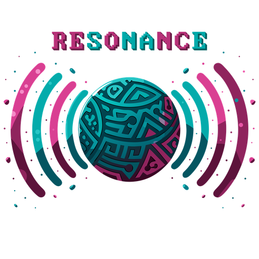

<p align="center" width="100%">
    
</p>

<h1 align="center">RESONANCE</h1>

<p align="center">
  
  
  
</p>

<p align="center">
  
  
</p>

<p align="center"><strong>Dotfile syncing that is for "users" not developers.</strong></p>

---

## 1. DESCRIPTION

RESONANCE keeps a vault of your dotfiles next to a live mirror of your system, so drift is
always visible before it's a problem. Add an app once; from then on it's a two-pane picture —
what's live, what's backed up, and a single button each way to fix whichever one's behind.
Fully local: no accounts, no sync server, no network calls of any kind.

---

## 2. DEPENDENCIES

**To simply use it — nothing to install by hand beyond the package itself:**

- **Arch Linux** — `webkit2gtk-4.1`, `gtk3`. The package declares these two and no others.
- **Debian / Ubuntu** — `libwebkit2gtk-4.1-0`, `libgtk-3-0`. Same two libraries only.

**To build it yourself:**

- **Go 1.25 or newer**, **Node 22**, and the **Wails v2 CLI**
  (`go install github.com/wailsapp/wails/v2/cmd/wails@latest`).
- The same two libraries' *development* headers — `webkit2gtk-4.1 base-devel pkgconf` on Arch,
  `libgtk-3-dev libwebkit2gtk-4.1-dev` on Debian/Ubuntu.
- **Arch ships WebKitGTK as `webkit2gtk-4.1`, but Wails looks for the older 4.0 API by
  default.** Every build in this project carries `-tags webkit2_41` to fix that — the commands
  below already include it.

---

## 3. INSTALLATION

### 3.A Build From Source

```bash
git clone https://github.com/sudo-megas/RESONANCE.git
cd RESONANCE
sudo pacman -S --needed go nodejs npm gtk3 webkit2gtk-4.1 base-devel pkgconf   # Arch
# or: sudo apt-get install -y libgtk-3-dev libwebkit2gtk-4.1-dev              # Debian/Ubuntu
go install github.com/wailsapp/wails/v2/cmd/wails@latest
wails build -tags webkit2_41
```

The binary lands at `build/bin/resonance`.

### 3.B Arch Linux

**Download it** — `resonance-1.2.0-1-x86_64.pkg.tar.zst` is on the
[Releases page](https://github.com/sudo-megas/RESONANCE/releases), so there is nothing to
build:

```bash
sudo pacman -U resonance-1.2.0-1-x86_64.pkg.tar.zst
```

Or build it yourself as in 3.A, then package what you made:

```bash
cd build/packaging && makepkg --noconfirm --nodeps
sudo pacman -U resonance-1.2.0-1-x86_64.pkg.tar.zst
```

**Via AUR** — not published yet. It is planned, but there is no `resonance` in the AUR today,
and a command you could paste that would simply fail is worse than saying so.

### 3.C Debian / Ubuntu

**Download it** — `resonance_1.2.0_amd64.deb` is on the
[Releases page](https://github.com/sudo-megas/RESONANCE/releases):

```bash
sudo dpkg -i resonance_1.2.0_amd64.deb || sudo apt-get install -f
```

The `apt-get install -f` fallback only matters if `libwebkit2gtk-4.1-0`/`libgtk-3-0` aren't
already on your system — it pulls them in and finishes the install.

There is no Windows build, and there won't be one — every dependency above is a Linux
desktop library RESONANCE genuinely links against.

---

## 4. HOW TO USE? WHAT IS THE APPLICATION SECTIONS?

| Section | What it's for |
|---|---|
| **Topbar** | The active vault path, a one-click **Change Path** switch (migration-aware — it re-scans before switching), the theme picker, Recent Activity (a persistent log of every add/update/restore/undo), and About. |
| **SYSTEM** (left pane) | Every app you're tracking on this machine, with a drift badge the moment its live files diverge from the vault. |
| **VAULT** (right pane) | The same apps as they sit in the vault. The mirror's whole point is these two panes staying identical. |
| **Spine** (center) | **+** adds a new app to track. **→** updates a drifted app from source, dates confirmed first. Each row's **←** restores that app from the vault — previewing every new, overwritten, and already-identical file, with a real content diff, before anything writes. |
| **Undo** | The same **←** button, once nothing's drifted: undoes the last restore. One button, everything back exactly as it was. |
| **Status bar** | Apps tracked, how many are drifted, and when anything last happened — all at a glance. (The vault path itself lives in the topbar, not duplicated here.) |

**File dates shown throughout are modification time only, never creation time** —
ext4/Linux has no reliable, portable way to read a file's creation date, so RESONANCE doesn't
pretend to.

RESONANCE makes no network requests of any kind. No telemetry, no analytics, no crash
reporting, no update checks. Updates are something you choose to install.

---

## 5. LICENCE SUMMARY

RESONANCE is free software under the **GNU General Public License, version 3 or later**
(`GPL-3.0-or-later`).

In plain terms: you may use it for anything, study how it works, share it with anyone, and
change it to suit yourself. If you distribute a changed version, it must carry this same
licence (or a later version of it) so that whoever receives it has the freedoms you had. It
comes with **no warranty**.

That is a summary and nothing more — the text that actually governs is the full
[`LICENSE`](LICENSE) file in this repository, and the same full text is readable inside the
application from the **About** page.

Copyright © sudo-megas · <https://github.com/sudo-megas/RESONANCE>

*Built with Reason and Passion.*
